# Integración de RabbitMQ con Spring

## 1. Introducción
RabbitMQ es un popular sistema de mensajería basado en el protocolo AMQP (Advanced Message Queuing Protocol). Permite a las aplicaciones comunicarse entre sí a través de mensajes asíncronos, desacoplando la producción y el consumo de mensajes. Esto es especialmente útil en arquitecturas de microservicios y en aplicaciones que requieren alta disponibilidad y escalabilidad.

Spring Boot es un marco de trabajo que facilita la creación de aplicaciones basadas en Spring, proporcionando una configuración predeterminada y simplificando el proceso de desarrollo. Integrar RabbitMQ con Spring Boot permite aprovechar las capacidades de mensajería de RabbitMQ de manera sencilla y efectiva dentro de una aplicación Spring.

En este tutorial, aprenderás a configurar e integrar RabbitMQ en una aplicación Spring Boot. Crearemos un proyecto desde cero utilizando IntelliJ IDEA, configuraremos RabbitMQ, y desarrollaremos un ejemplo práctico de productor y consumidor de mensajes. Al finalizar este tutorial, tendrás una comprensión clara de cómo utilizar RabbitMQ en un entorno Spring Boot para manejar la mensajería asincrónica.

## 2. Entorno
Este tutorial se ha desarrollado en el siguiente entorno:

- **Hardware**: portátil MacBook Pro (15′, mediados 2010).
- **Sistema operativo**: Mac OS X Yosemite 10.10.5.
- **IDE**: IntelliJ IDEA 14 Ultimate.
- **Versión de Java**: 1.8.0_60

## 3. Servidor de RabbitMQ
Instalamos el servidor de RabbitMQ. Descárgalo desde [aquí](https://www.rabbitmq.com/download.html) o, si utilizas Mac, de [aquí](https://brew.sh/) o a través de Homebrew:

```sh
$ brew install rabbitmq
```

Ejecuta el script rabbitmq-server. Si has descargado RabbitMQ manualmente, se encontrará en rabbitmq_server-x.y.z/sbin/. Si lo has instalado con Homebrew en Mac, la ruta será /usr/local/Cellar/rabbitmq/x.y.z/sbin/. Añade esta ruta al PATH para ejecutar rabbitmq-server desde cualquier directorio en la terminal.

```sh
$ rabbitmq-server
```

Deberías ver algo similar a esto:

```shell
RabbitMQ x.y.z. Copyright (C) 2007-2015 Pivotal Software, Inc.
##  ##      Licensed under the MPL.  See http://www.rabbitmq.com/
##  ##
##########  Logs: /usr/local/var/log/rabbitmq/rabbit@localhost.log
######  ##        /usr/local/var/log/rabbitmq/rabbit@localhost-sasl.log
##########
          Starting broker... completed with 10 plugins.
```

## 4. Creación del Proyecto en IntelliJ IDEA

Lo primero que vamos a hacer es crear un proyecto Spring Boot. Spring Boot nos sirve para crear y ejecutar aplicaciones Spring de una manera más sencilla.

En nuestro caso, empleamos IntelliJ IDEA como IDE. Seguimos los pasos mostrados en las capturas de pantalla:

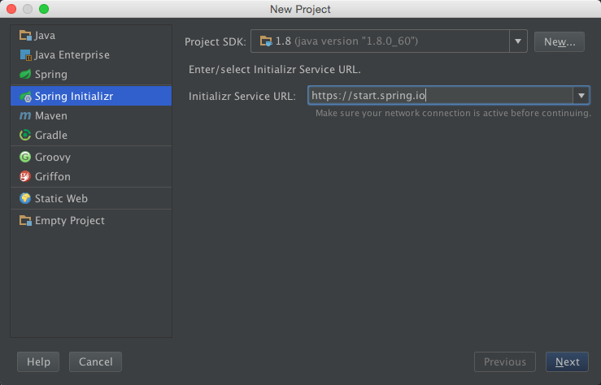
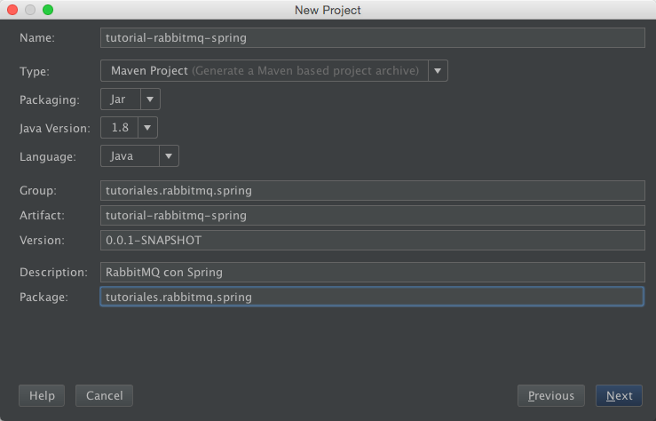
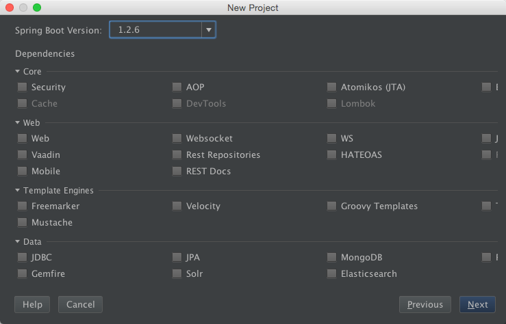
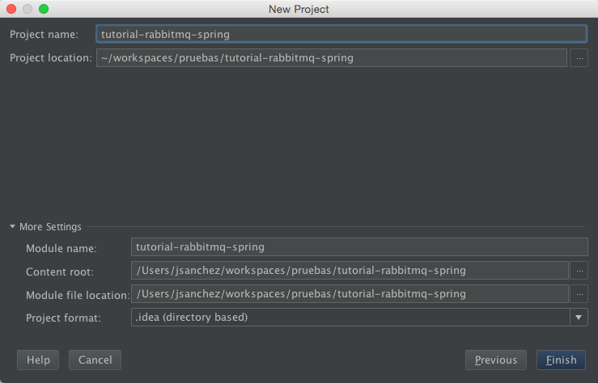

Tras crear el proyecto nos saldrá un mensaje pidiendo que añadamos el pom.xml como proyecto Maven.

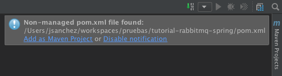

Este mensaje también lo podemos ver si hacemos clic en la parte inferior izquierda del IDE.

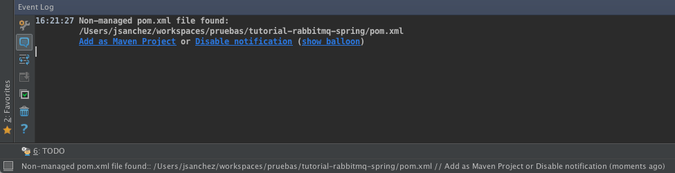

Lo añadimos y esperamos a que IntelliJ sincronice automáticamente las dependencias.

En este momento ya tenemos una aplicación que se puede ejecutar (el método main usa SpringApplication.run para ejecutarla). Lo comprobamos haciendo clic derecho en el archivo TutorialRabbitmqSpringApplication.java y dándole a «Run / TutorialRabbitmqSpringApplication».

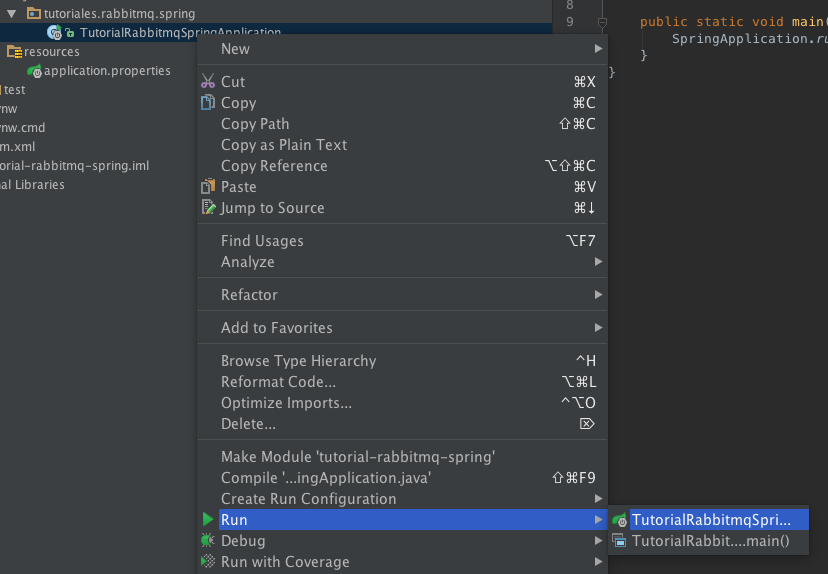

```xml
<project xmlns="http://maven.apache.org/POM/4.0.0"
         xmlns:xsi="http://www.w3.org/2001/XMLSchema-instance"
         xsi:schemaLocation="http://maven.apache.org/POM/4.0.0 http://maven.apache.org/xsd/maven-4.0.0.xsd">
    <modelVersion>4.0.0</modelVersion>
    <groupId>tutoriales.rabbitmq.spring</groupId>
    <artifactId>tutorial-rabbitmq-spring</artifactId>
    <version>0.0.1-SNAPSHOT</version>
    <packaging>jar</packaging>

    <name>tutorial-rabbitmq-spring</name>
    <description>RabbitMQ con Spring</description>

    <parent>
        <groupId>org.springframework.boot</groupId>
        <artifactId>spring-boot-starter-parent</artifactId>
        <version>1.2.6.RELEASE</version>
    </parent>

    <properties>
        <java.version>1.8</java.version>
    </properties>

    <dependencies>
        <dependency>
            <groupId>org.springframework.boot</groupId>
            <artifactId>spring-boot-starter-amqp</artifactId>
            <version>1.2.6.RELEASE</version>
        </dependency>
    </dependencies>

    <build>
        <plugins>
            <plugin>
                <groupId>org.springframework.boot</groupId>
                <artifactId>spring-boot-maven-plugin</artifactId>
            </plugin>
        </plugins>
    </build>
</project>
```

## 5. Implementación

El proyecto constará de tres clases: `TutorialRabbitmqSpringApplication`, `Receiver` y `RabbitMqConfig`.

Receiver.java

```java
package tutoriales.rabbitmq.spring;

public class Receiver {

    public static final String RECEIVE_METHOD_NAME = "receiveMessage";

    public void receiveMessage(String message) {
        System.out.println("[Receiver] ha recibido el mensaje \"" + message + '"');
    }
}
```

Receiver simplemente se encarga de imprimir el mensaje recibido.

RabbitMqConfig.java

```java
package tutoriales.rabbitmq.spring;

import org.springframework.amqp.core.Binding;
import org.springframework.amqp.core.BindingBuilder;
import org.springframework.amqp.core.Queue;
import org.springframework.amqp.core.TopicExchange;
import org.springframework.amqp.rabbit.connection.ConnectionFactory;
import org.springframework.amqp.rabbit.listener.SimpleMessageListenerContainer;
import org.springframework.amqp.rabbit.listener.adapter.MessageListenerAdapter;
import org.springframework.context.annotation.Bean;
import org.springframework.context.annotation.Configuration;

@Configuration
public class RabbitMqConfig {

    public static final String EXCHANGE_NAME = "exchange_name";
    public static final String ROUTING_KEY = "routing_key";

    private static final String QUEUE_NAME = "queue_name";
    private static final boolean IS_DURABLE_QUEUE = false;

    @Bean
    Queue queue() {
        return new Queue(QUEUE_NAME, IS_DURABLE_QUEUE);
    }

    @Bean
    TopicExchange exchange() {
        return new TopicExchange(EXCHANGE_NAME);
    }

    @Bean
    Binding binding(Queue queue, TopicExchange exchange) {
        return BindingBuilder.bind(queue).to(exchange).with(ROUTING_KEY);
    }

    @Bean
    SimpleMessageListenerContainer container(ConnectionFactory connectionFactory, MessageListenerAdapter listenerAdapter) {
        final SimpleMessageListenerContainer container = new SimpleMessageListenerContainer();
        container.setConnectionFactory(connectionFactory);
        container.setQueueNames(QUEUE_NAME);
        container.setMessageListener(listenerAdapter);
        return container;
    }

    @Bean
    Receiver receiver() {
        return new Receiver();
    }

    @Bean
    MessageListenerAdapter listenerAdapter(Receiver receiver) {
        return new MessageListenerAdapter(receiver, Receiver.RECEIVE_METHOD_NAME);
    }
}
```

La clase RabbitMqConfig viene anotada con `@Configuration` para indicar a Spring que contendrá definiciones de beans, los cuales son aquellos métodos que están anotados con `@Bean`. Vamos a ver para qué sirve cada uno:

```java
@Bean
Queue queue() {
    return new Queue(QUEUE_NAME, IS_DURABLE_QUEUE);
}
```

Crea una cola a la que le otorga un nombre y le define su durabilidad.

```java
@Bean
TopicExchange exchange() {
    return new TopicExchange(EXCHANGE_NAME);
}
```

Crea un exchange de tipo topic y le asigna un nombre.

```java
@Bean
Binding binding(Queue queue, TopicExchange exchange) {
    return BindingBuilder.bind(queue).to(exchange).with(ROUTING_KEY);
}
```

Enlaza una cola con un exchange de tipo topic. Con with se define la clave del enlace.

```java
@Bean
SimpleMessageListenerContainer container(ConnectionFactory connectionFactory, MessageListenerAdapter listenerAdapter) {
    final SimpleMessageListenerContainer container = new SimpleMessageListenerContainer();
    container.setConnectionFactory(connectionFactory);
    container.setQueueNames(QUEUE_NAME);
    container.setMessageListener(listenerAdapter);
    return container;
}
```

Contenedor en el que se indican quiénes son los consumidores de las colas.

```java
@Bean
Receiver receiver() {
    return new Receiver();
}
```

Receptor del mensaje.

```java
@Bean
MessageListenerAdapter listenerAdapter(Receiver receiver) {
    return new MessageListenerAdapter(receiver, Receiver.RECEIVE_METHOD_NAME);
}
```

Adaptador para indicar quién recibe el mensaje y qué método lo procesa.

**Nota**: si te aparece el aviso de que el contexto de la aplicación no está configurado para RabbitMqConfig, como se ve en la siguiente imagen:

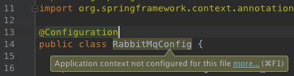

entonces deberás ir a «File / Project Structure… / Project Settings / Modules»:


hacer clic derecho en «tutorial-rabbitmq-spring», «Add / Spring»:

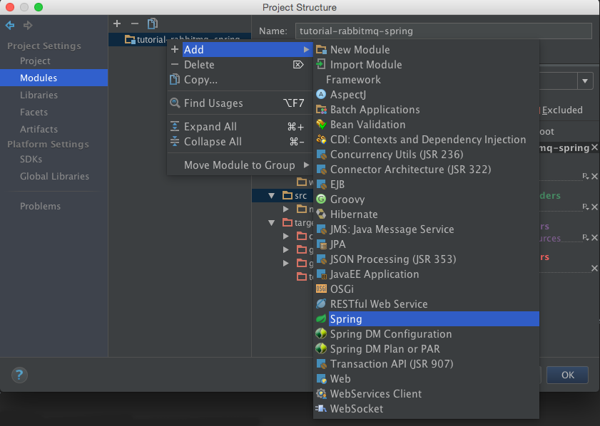

y seguir estos pasos:

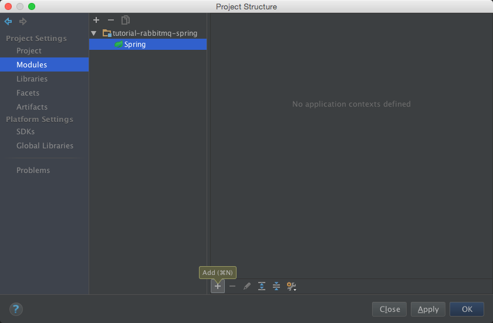
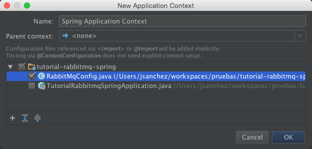
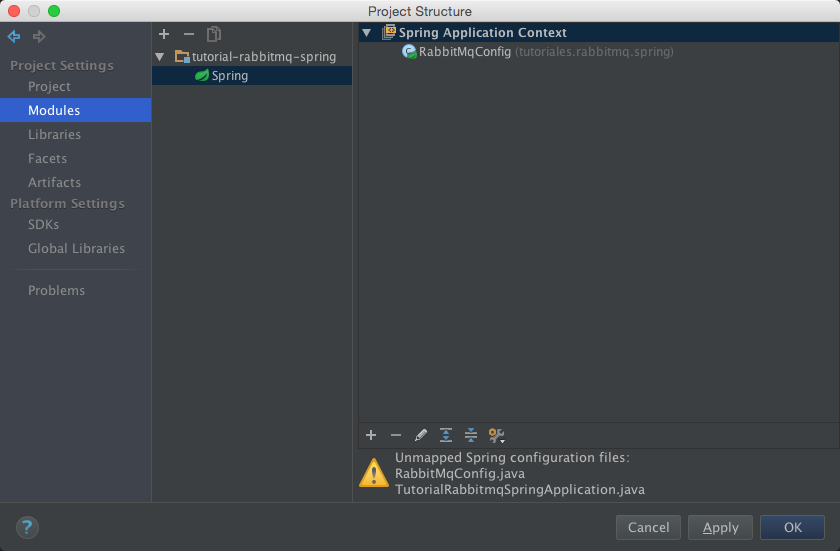

TutorialRabbitmqSpringApplication.java

```java
package tutoriales.rabbitmq.spring;

import org.springframework.amqp.rabbit.core.RabbitTemplate;
import org.springframework.beans.factory.annotation.Autowired;
import org.springframework.boot.CommandLineRunner;
import org.springframework.boot.SpringApplication;
import org.springframework.boot.autoconfigure.SpringBootApplication;

@SpringBootApplication
public class TutorialRabbitmqSpringApplication implements CommandLineRunner {

    private static final String MESSAGE = "Hello world!";

    @Autowired
    RabbitTemplate rabbitTemplate;

    public static void main(String[] args) {
        SpringApplication.run(TutorialRabbitmqSpringApplication.class, args);
    }

    @Override
    public void run(String... args) throws InterruptedException {
        System.out.println("[Application] Enviando el mensaje \"" + MESSAGE + "\"...");
        rabbitTemplate.convertAndSend(RabbitMqConfig.EXCHANGE_NAME, RabbitMqConfig.ROUTING_KEY, MESSAGE);
    }
}
```

La clase `TutorialRabbitmqSpringApplication` está anotada con `@SpringBootApplication`. Esta anotación, propia de Spring Boot, equivale a añadir las siguientes:

- `@Configuration`: Indica que contiene beans.
- `@EnableAutoConfiguration`: Activa la autoconfiguración del contexto de aplicación de Spring para que busque los beans que se van a necesitar.
- `@ComponentScan`: Dice a Spring que busque componentes, configuraciones y servicios en el paquete de la clase.

Con la anotación `@Autowired`, incluimos el bean `RabbitTemplate` que nos proporciona Spring. En concreto, este template nos ayuda a enviar y recibir mensajes de una manera realmente sencilla: a través del método `convertAndSend` indicamos que queremos enviar el mensaje `MESSAGE` a las colas que tengan un enlace al exchange `EXCHANGE_NAME` con clave `ROUTING_KEY`.


### 5.1. Configuración de RabbitMQ
La conexión con el servidor de RabbitMQ se puede configurar a través del archivo `application.properties`, que admite las siguientes propiedades:

`application.properties`:

```properties
# RabbitMQ properties
spring.rabbitmq.host=
spring.rabbitmq.port=
spring.rabbitmq.addresses=
spring.rabbitmq.username=
spring.rabbitmq.password=
spring.rabbitmq.virtual-host=
spring.rabbitmq.dynamic=
```
Si se omiten, por defecto tomará: localhost, el puerto 5672, el usuario guest, la contraseña guest y el host virtual /.

## 6. Ejecución
Lo primero es ejecutar el servidor de RabbitMQ con rabbitmq-server si no lo hemos hecho antes. Entonces ya podremos iniciar la aplicación.

Por consola, además de la salida propia de Spring Boot, deberá aparecer:

```
[Application] Enviando el mensaje "Hello world!"...
[Receiver] ha recibido el mensaje "Hello world!"
```

## 7. Conclusiones
La integración de RabbitMQ con Spring no tiene ninguna dificultad, pues en un rato hemos sido capaces de crear desde cero un proyecto que se sirve del framework Spring para enviar mensajes a través de RabbitMQ.